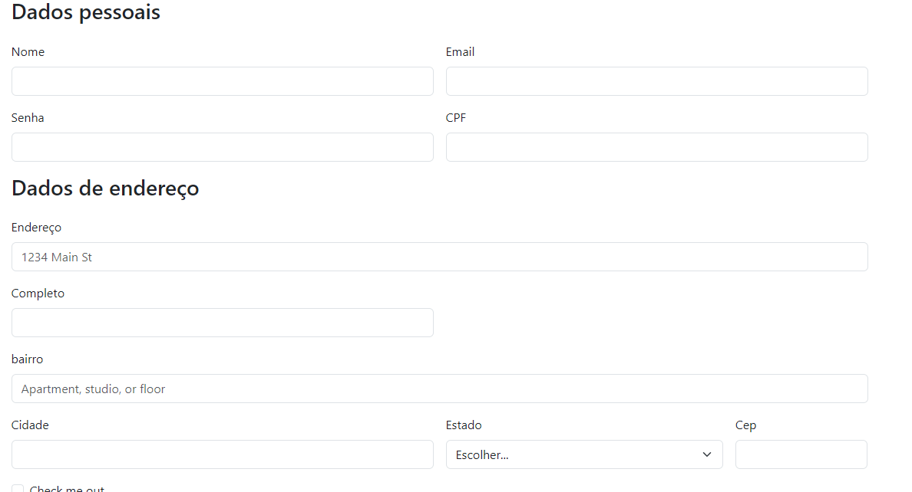

# Projeto - Cadastro de E-commerce
Começamos procurando referencias dos sites para fazer o meu site, pegamos 3 sites como referencia.

os sites consultados foram:

## SHOPEE

Na SHOPEE os campos identificados foram:

* Número de Usuário
* Nome 
* E-mail 
* Número de Telefone
* sexo 
* CPF 
* Data de Nascimento

## MUNDO STREET 

No MUNDO STREET os campos identificados foram:

* Primeiro nome/sobrenome
* E-mail
* Senha 
* CPF 

## RIACHUELO

Na RIACHUELO os campos identificados foram:

* CPF
* Senha
* Nome completo 
* E-mail 
* Data de Nascimento 
* Celular

## Formulario de cadastro de E-commerce

No meu formulario eu usei 3 sites diferentes para pegar algumas referencias, usei de bases algumas informações para montar o meu formulario. 

No meu formulario eu usei as seguintes informações:

* Nome 
* E-mail 
* Senha 
* CPF
* Endereço 
* Completo 
* Bairro 
* Cidade 
* Estado 
* CEP 

#
### 🎓Tecnologias Utilizadas:
* VScode
* Github/Git bash
* Html 5
* CSS 3
* Live Server
#
### Autor:
#### Nicolas Modesto José

